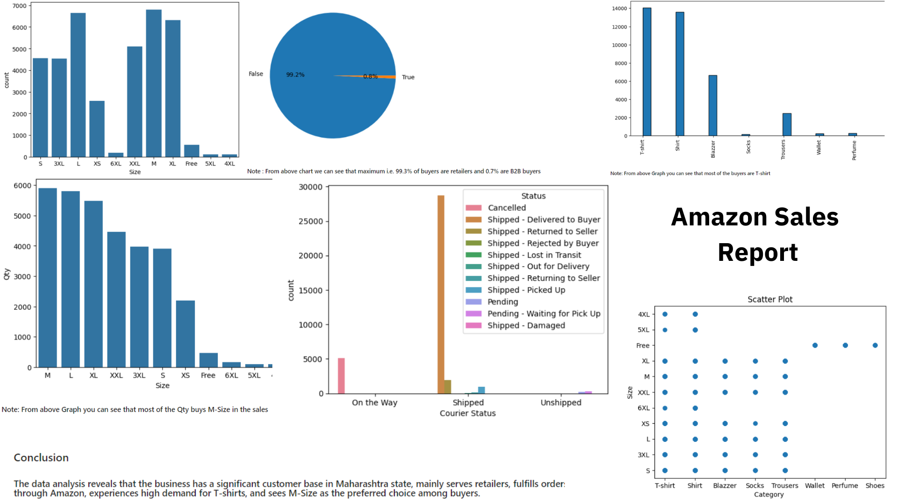
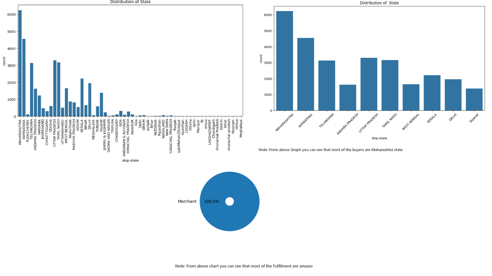

# Project Overview

*This project analyzed Amazon sales data using Python, with Pandas for data preparation and Matplotlib and Seaborn for visualizations. It uncovered key sales trends and performance metrics, presenting insights to support strategic decision-making.*

-------------------------------------------------------------------------------------------------------------------------------------------------
## Data and Exploration

### - Dataset  

 **`Amazon Sales Data.csv`** 

-------------------------------------------------------------------------------------------------------------------------------------------------

